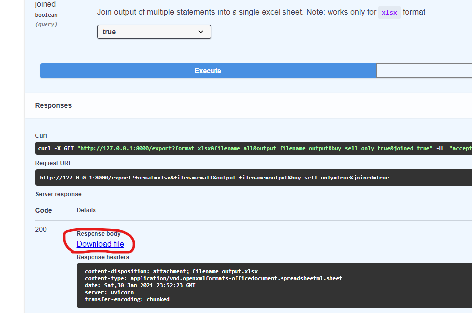
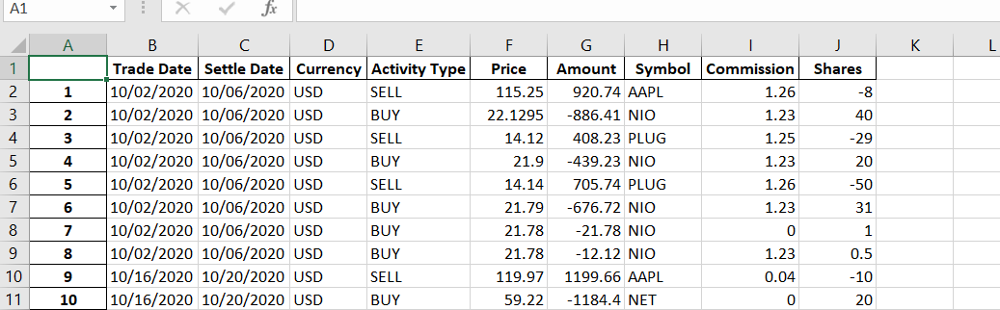

### Export Revolut statements
Script was mainly done for easier calculation of capital gain for the previous year.
For trading account, Revolut only offers statements in a form of pdf, and because of that 
it is hard to determine how much of the realized gain you had in a certain time period.
When (if) Revolut ever implements csv exports this will become obsolete.

#### Installation steps

* Go to the [Python website](https://www.python.org/downloads) and install `python 3`
* Clone this repository and navigate to it
* [Optional] Install `virtualenv`, create new environment and activate it
* Open up terminal and install requirements: `pip install -r requirements.txt`
* Create folder inside the project and call it `statements`
* Move Revolut statements which you want to export into `statements` folder
* Finally run the app: `uvicorn main:app`
* Once up and running, navigate to: `http://127.0.0.1:8000/docs`
* Start exporting by following directions in the `/export` endpoint

Example of the download link after export:

Also, here is the preview of excel file after exporting data using `.xlsx` format.
Negative value means it was a `SELL` action. In the statements itself it is represented with parentheses.

Happy exporting!! :satisfied:
